<center>
#CS 184: Project 3-1 Pathtracer

###Jieming Fan 3034504370
</center>
---
## Overview


### Part 1: Ray Generation and Scene Intersection

1. Walk through the ray generation and primitive intersection parts of the rendering pipeline.

	In order to generate the rays, first I complete the function ```Camera::generate_ray```. The ray formula is ```ray = o + t * d```. Where *o* is a vector representing the origin, *t* is a scalar representing the travelling time along direction *d*, and *d* is the direction of the ray. In camera's coordinate system, the camera is positioned at the origin, and its bottom left and top right corners at:
<p align="middle"><pre align="middle">Vector3D(-tan(radians(hFov)\*.5), -tan(radians(vFov)\*.5),-1)
Vector3D( tan(radians(hFov)\*.5),  tan(radians(vFov)\*.5),-1)</pre></p>
Convert the input point to a point on this sensor so that (0,0) maps to the bottom left and (1,1) maps to the top right. The corresponding x, y, z can be calculated by:
<p align="middle"><pre align="middle">X = bottom\_left.x + (top\_right.x - bottom\_left.x) * x
Y = bottom\_left.y + (top\_right.y - bottom\_left.y) * y
Z = -1</pre></p>
Because the camera looks along the -z axis, so set z be -1. Multuply this by *c2w* to convert it to world space. Then I could get the ray's *r* and *d*.

2. Explain the triangle intersection algorithm you implemented in your own words.
	
	I use the Moller Trumbore algorithm for triangle intersection. In this algorithm, a point in triangle is presented as:
<p align="middle"><pre align="middle">P = (1 - b1 - b2) * P0 + b1 * P1 + b2 * P2</pre></p>
where *P0*, *P1* and *P2* are the triangles vertices. Use this equation and the ray equation, I could compute the *t* in ray equation and *b1*, *b2* in triangle equation by following formulas:
<p align="middle"><pre align="middle">E1 = p2 - p1; E2 = p3 - p1; S = r.o - p1; S1 = cross(r.d, E2); S2 = cross(S, E1);
t = 1 / (dot(S1, E1)) * dot(S2, E2);
b1 = 1 / (dot(S1, E1)) * dot(S1, S);
b2 = 1 / (dot(S1, E1)) * dot(S2, r.d);</pre></p>
Then, check the validation of *t*, *b1* and *b2*. The validation check  includes checking if *b1*, *b2* are between 0 and 1, *b1* + *b2* <= 1 and *t* is in [min_t, max_t].

3. Show the normal shading for a few small *dae* files.
<div align="middle">
  <table style="width=100%">
    <tr>
      <td>
        
        <figcaption align="middle">CBspheres\_lambertian.dae</figcaption>
      </td>
      <td>
        
        <figcaption align="middle">cow.dae</figcaption>
      </td>
    </tr>
    <tr>
      <td>
        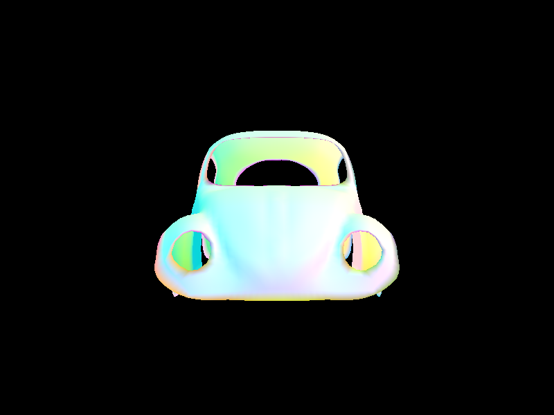
        <figcaption align="middle">beetle.dae</figcaption>
      </td>
      <td>
        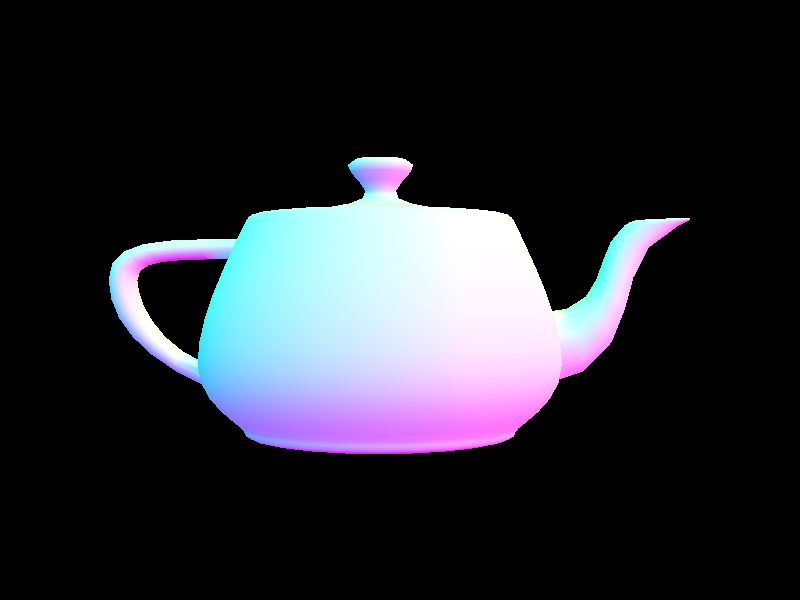
        <figcaption align="middle">teapot.dae</figcaption>
      </td>
    </tr>
  </table>
</div>

###Part 2: Bounding Volume Hierarchy

1. Walk through your BVH construction algorithm. Explain the heuristic you chose for picking the splitting point.

	+ Compute the bounding box of the primitives in ```prims```.
	+ Pick the axis to split by choosing the largest dimension of the bounding box's extent.
	+ Use the average of the centroids of the primitives as the splitting point.
	+ Split all primitives in ```prims``` into two new vectors ```left_prims``` and ```right_prims``` based on whether their bounding box's centroid's coordinate in the chosen axis is less than or greater than the splitting point.
	+ Recursively call function ```construct_bvh``` on the left and right node to split up the primitives until the number of primitives is less than ```max_leaf_size```.
	
2. Walk through your BVH intersection algorithm.

	+ Check if a ray intersects the bounding box, if not, this ray can not intersect any primitives in this bounding box, and just return false.
	+ Check if the t0 and t1 returned by the bounding box's ```intersect``` function are within ray.min_t and ray.max_t. If ```t1 < ray.min_t``` or ```t0 > ray.max_t```, also return false.
	+ If the ray hits the bounding box, we need to consider whether the bounding box is a leaf node. 
	+ If it's a leaf node, we need to check every primitives in the box and get the closet hit.
	+ If it's not a leaf node, we recursively call function ```BVHAccel::intersect``` for its left child and right child, and return the results returned by its children.

3. Show the normal shading for a few large *dae* files that you couldn't render without the acceleration structure.
<div align="middle">
  <table style="width=100%">
    <tr>
      <td>
        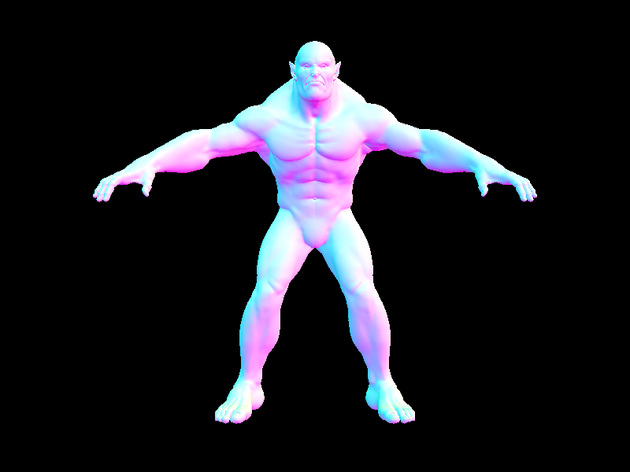
        <figcaption align="middle">beast.dae</figcaption>
      </td>
      <td>
        
        <figcaption align="middle">blob.dae</figcaption>
      </td>
    </tr>
    <tr>
      <td>
        
        <figcaption align="middle">CBlucy.dae</figcaption>
      </td>
      <td>
        
        <figcaption align="middle">dragon.dae</figcaption>
      </td>
    </tr>
    <tr>
      <td>
        
        <figcaption align="middle">maxplanck.dae</figcaption>
      </td>
      <td>
        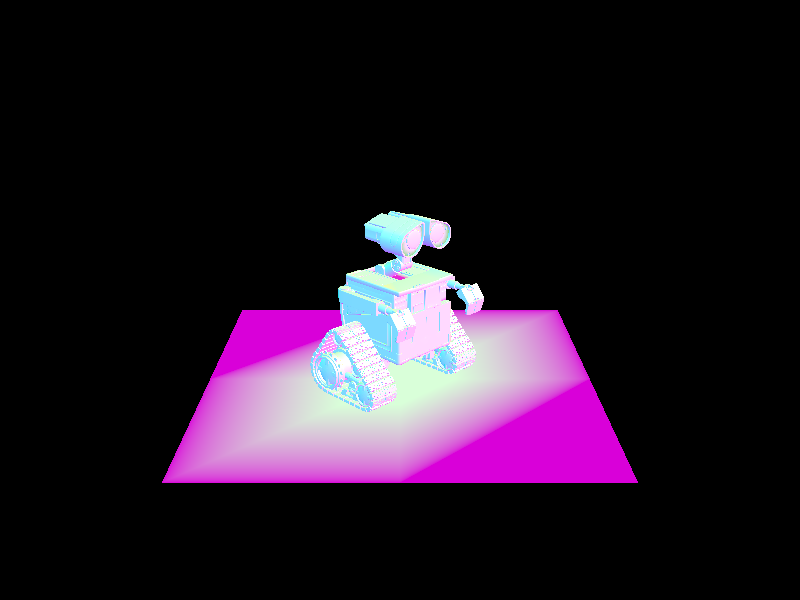
        <figcaption align="middle">wall-e.dae</figcaption>
      </td>
    </tr>
  </table>
</div>

4. Perform some rendering speed experiments on the scenes, and present your results and a 1-paragraph analysis.

<center>

| *dae* files | Without BVH | With BVH |
| :------: | :-------: | :-----------: |
| CBspheres_lambertian | 0.4056s | 0.1531s |
| cow | 78.6686s | 0.3434s |
| teapot | 30.5015s | 0.2119s |
| beetle | 103.5325s | 0.2152s |
| CBlucy | Really slow | 0.3556s |

</center>

By using the BVH intersection algorithm, we could avoid checking every primitives in the scene. If a ray doesn't hit a bounding box, we could skip it safely because the ray definitely won't hit any primitives in this box. As a result, this algorithm really reduces the time used for rendering a lot. 

###Part 3: Direct Illumination

1. Walk through both implementations of the direct lighting function.
	
	1. Uniform hemisphere sampling, function ```PathTracer::estimate_direct_lighting_hemisphere```
		+ Randomly choose a incident ray at the hit point because we don't know the information about the light source. Get the ray's information and ```pdf```.
		+ Cast a new shadow ray from the hit point (offset the origin of the ray from the hit point by a little), and check if the ray intersects with any objects.
		+ If the shadow ray intersects any objects, we caculate emission ray from that intersection point and scale it to get its contribution to the output ray. 
	
	2. Sampling over lights, function ```PathTracer::estimate_direct_lighting_importance```
		+ Iterate all the lights in scene, for each light, ask for ```ns_area_light``` samples. (If the light is a delta light, which means all samples will be the same, we just need to ask for one sample).
		+ For each sample, we could get the incoming radiance ```sp```, direction vector ```wi``` for the direction from hit point to light source, ```distToLight``` which is the distance from hit point to light source and ```pdf```.
		+ Also, cast a shadow ray from the hit point towards the light, and set the ray's ```max_t``` to be the ```distToLight```, bacause the intersections behind the light source is useless.
		+ If the shadow ray dose **NOT** intersect any objects, we use the ```sp``` and scale it to get its contribution to the output ray. 

2. Show some images rendered with both implementations of the direct lighting function.
<div align="middle">
  <table style="width=100%">
    <tr>
      <td>
        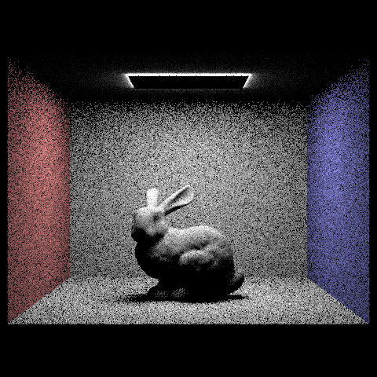
        <figcaption align="middle">CBbunny.dae with uniform hemisphere sampling s=16 l=8 </figcaption>
      </td>
      <td>
        
        <figcaption align="middle">CBbunny.dae with light sampling s=16 l=8 </figcaption>
      </td>
    </tr>
    <tr>
      <td>
        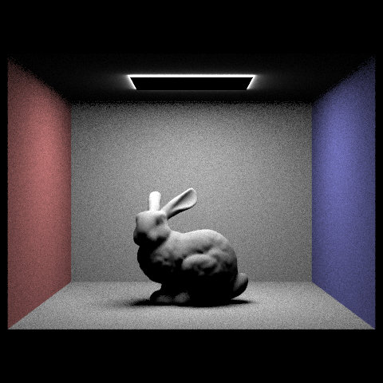
        <figcaption align="middle">CBbunny.dae with uniform hemisphere sampling s=64 l=32 </figcaption>      
      </td>
      <td>
        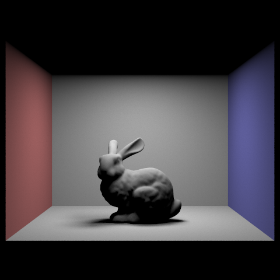
        <figcaption align="middle">CBbunny.dae with light sampling s=64 l=32 </figcaption> 
      </td>
    </tr>
    <tr>
      <td>
        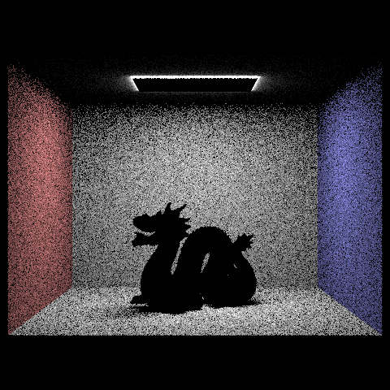
        <figcaption align="middle">CBdragon.dae with uniform hemisphere sampling s=16 l=8 </figcaption>      
      </td>
      <td>
        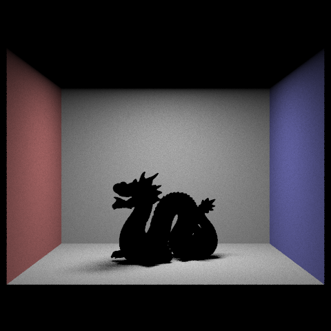
        <figcaption align="middle">CBdragon.dae with light sampling s=16 l=8 </figcaption> 
      </td>
    </tr>
    <tr>
      <td>
        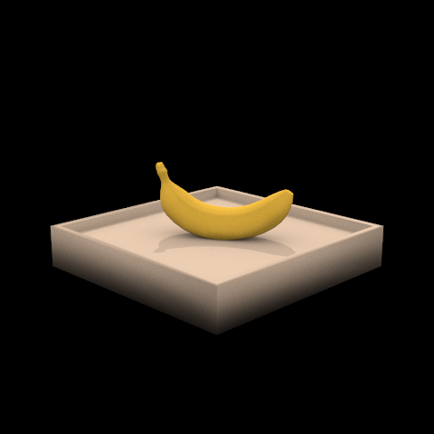
        <figcaption align="middle">banana.dae with light sampling s=64 l=32 </figcaption>      
      </td>
      <td>
        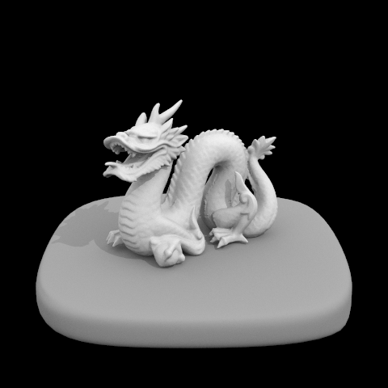
        <figcaption align="middle">dragon.dae with light sampling s=64 l=32 </figcaption> 
      </td>
    </tr>
  </table>
</div>

3. Focus on one particular scene (with at least one area light) and compare the noise levels in soft shadows when rendering with 1, 4, 16, and 64 light rays (the -l flag) and 1 sample per pixel (the -s flag) using light sampling, not uniform hemisphere sampling.
<div align="middle">
  <table style="width=100%">
    <tr>
      <td>
        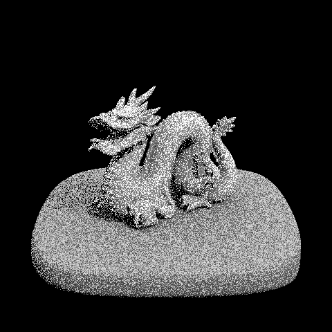
        <figcaption align="middle">dragon.dae with light sampling s=1 l=1</figcaption>
      </td>
      <td>
        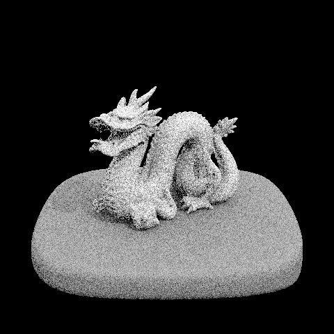
        <figcaption align="middle">dragon.dae with light sampling s=1 l=4</figcaption>
      </td>
    </tr>
    <tr>
      <td>
        
        <figcaption align="middle">dragon.dae with light sampling s=1 l=16</figcaption>      
      </td>
      <td>
        
        <figcaption align="middle">dragon.dae with light sampling s=1 l=64</figcaption> 
      </td>
    </tr>
  </table>
</div>

4. Compare the results between using uniform hemisphere sampling and lighting sampling, including a 1-paragraph analysis.
<div align="middle">
  <table style="width=100%">
    <tr>
      <td>
        
        <figcaption align="middle">CBbunny.dae with uniform hemisphere sampling s=16 l=8 </figcaption>
      </td>
      <td>
        
        <figcaption align="middle">CBbunny.dae with light sampling s=16 l=8 </figcaption>
      </td>
    </tr>
    <tr>
      <td>
        
        <figcaption align="middle">CBbunny.dae with uniform hemisphere sampling s=64 l=32 </figcaption>      
      </td>
      <td>
        
        <figcaption align="middle">CBbunny.dae with light sampling s=64 l=32 </figcaption> 
      </td>
    </tr> 
  </table>
</div>
	The uniform hemisphere sampling has more noise than the lighting sampling does. Uniform hemisphere sampling needs a higher ```samples_per_pixel``` and ```ray_per_pixel``` to get a revelent good result with little noise, while the lighting sampling could perform very with low ```samples_per_pixel``` and ```ray_per_pixel```.

###Part 4: Global Illumination

1. Walk through your implementation of the indirect lighting function.

	+ Complete the function ```PathTracer::est_radiance_global_illumination```, which is used to get an estimate of the total radiance with global illumination arriving at a point from a particular direction. We need to add the direct illumination calculated by the function ```PathTracer::zero_bounce_radiance``` and the indirect illumination calculated by the function ```PathTracer::at_least_one_bounce_radiance``` together to get the total radiance.
	+ Function ```PathTracer::zero_bounce_radiance``` simply return the light emitted by the given point and outgoing direction.
	+ Function ```PathTracer::at_least_one_bounce_radiance``` will call the function ```PathTracer::one_bounce_radiance``` which is the direct illumination, and then recursively call itself to estimate the higher bounces. In this function, we use Russian roulette and ```max_ray_depth``` to terminate the ray. 

2. Show some images rendered with global (direct and indirect) illumination. Use 1024 samples per pixel.
<div align="middle">
  <table style="width=100%">
    <tr>
      <td>
        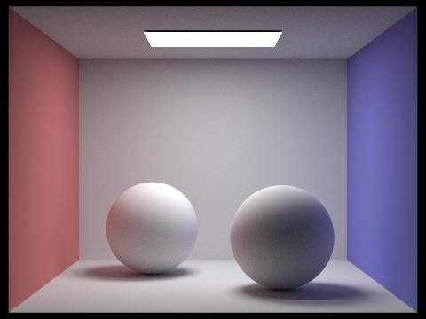
        <figcaption align="middle">CBspheres\_lambertian.dae s=1024 l=16 m=5 </figcaption>
      </td>
      <td>
        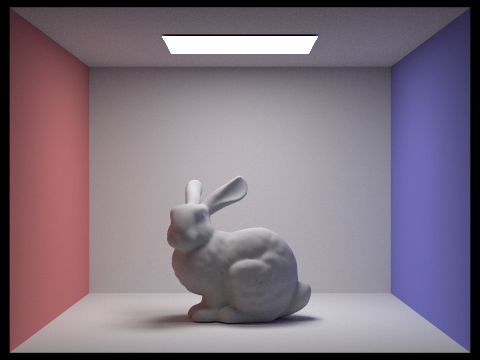
        <figcaption align="middle">CBbunny.dae s=1024 l=4 m=3 </figcaption>
      </td>
    </tr>
    <tr>
      <td>
        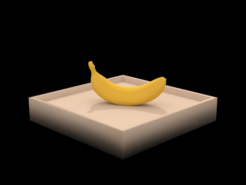
        <figcaption align="middle">banana.dae s=1024 l=4 m=3 </figcaption>      
      </td>
      <td>
        
        <figcaption align="middle">dragon.dae s=1024 l=4 m=3 </figcaption> 
      </td>
    </tr> 
  </table>
</div>

3. Pick one scene and compare rendered views first with only direct illumination, then only indirect illumination. (You'll have to edit ```at_least_one_bounce_radiance``` in your code to generate these.) Use 1024 samples per pixel.
<div align="middle">
  <table style="width=100%">
    <tr>
      <td>
        
        <figcaption align="middle">banana.dae with only direct illumination s=1024 l=4 m=3 </figcaption>
      </td>
      <td>
        
        <figcaption align="middle">banana.dae with only indirect illumination s=1024 l=4 m=3 </figcaption>
      </td>
    </tr>
  </table>
</div>

4. For ```CBbunny.dae```, compare rendered views with ```max_ray_depth``` equal to 0, 1, 2, 3, and 100 (the -m flag). Use 1024 samples per pixel.
<div align="middle">
  <table style="width=100%">
    <tr>
      <td>
        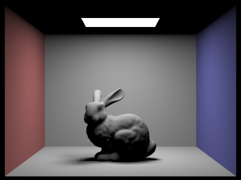
        <figcaption align="middle">CBbunny.dae s=1024 l=4 m=0 </figcaption>
      </td>
      <td>
        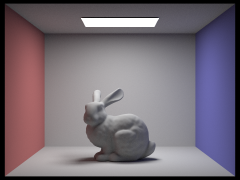
        <figcaption align="middle">CBbunny.dae s=1024 l=4 m=1 </figcaption>
      </td>
    </tr>
    <tr>
      <td>
        
        <figcaption align="middle">CBbunny.dae s=1024 l=4 m=2 </figcaption>      
      </td>
      <td>
        
        <figcaption align="middle">CBbunny.dae s=1024 l=4 m=3 </figcaption> 
      </td>
    </tr> 
    <tr>
      <td>
        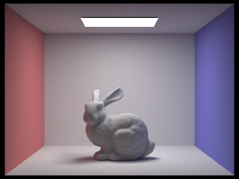
        <figcaption align="middle">CBbunny.dae s=1024 l=4 m=100 </figcaption>      
      </td>
    </tr>
  </table>
</div>

5. Pick one scene and compare rendered views with various sample-per-pixel rates, including at least 1, 2, 4, 8, 16, 64, and 1024. Use 4 light rays.
<div align="middle">
  <table style="width=100%">
    <tr>
      <td>
        
        <figcaption align="middle">dragon.dae s=1 l=4 m=3 </figcaption>
      </td>
      <td>
        
        <figcaption align="middle">dragon.dae s=2 l=4 m=3 </figcaption>
      </td>
    </tr>
    <tr>
      <td>
        
        <figcaption align="middle">dragon.dae s=4 l=4 m=3 </figcaption>      
      </td>
      <td>
        
        <figcaption align="middle">dragon.dae s=8 l=4 m=3  </figcaption> 
      </td>
    </tr> 
    <tr>
      <td>
        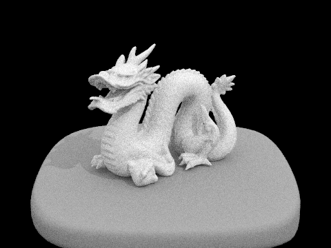
        <figcaption align="middle">dragon.dae s=16 l=4 m=3 </figcaption>      
      </td>
      <td>
        
        <figcaption align="middle">dragon.dae s=64 l=4 m=3  </figcaption> 
      </td>
    </tr> 
    <tr>
      <td>
        
        <figcaption align="middle">dragon.dae s=1024 l=4 m=3 </figcaption>      
      </td>
    </tr>
  </table>
</div>

###Part 5: Adaptive Sampling